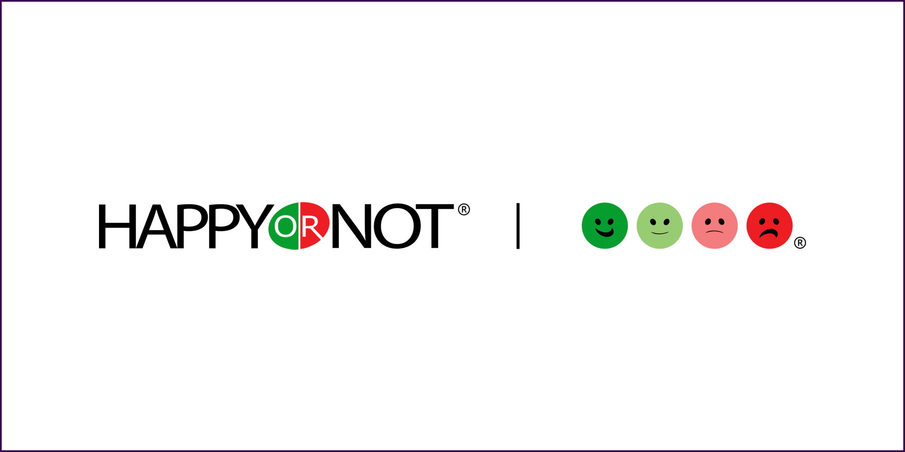

```{r setup, include=FALSE}
knitr::opts_chunk$set(echo = TRUE, warning = FALSE, message = FALSE)
```

###Introduction

HappyDB is a corpus of 100,000 crowd-sourced happy moments, more details of the information could be found on the website https://arxiv.org/abs/1801.07746 and https://github.com/rit-public/HappyDB. In this project, we use a version of processed data 'processed_moments.csv' by file 'Text_Processing.Rmd' as well as file 'demographic.csv' which contains demographic information of the observations, it could be found on the website https://raw.githubusercontent.com/rit-public/HappyDB/master/happydb/data/demographic.csv. Based on the data sets, we aim to explore the data using visualized graphs and study the answers to the question, "What makes people happy?" via more advanced text mining tools such as sentiment analysis,  topic model. We hope it would be a good start for people who are interested in this topic.


###Load required libaries and Merge text data with demographic information

First, we load required packages for analysis and merge the processed text data with demographic data, several rows of the merged data are shown as below:

```{r}
library(tidyverse)
library(tidytext)
library(DT)
library(scales)
library(gridExtra)
library(wordcloud)
library(tidyr)
library(ngram)
library(stringr)
library(broom)
library(rworldmap)
library(topicmodels)
hm_data <- read_csv("../output/processed_moments.csv")
urlfile<-'https://raw.githubusercontent.com/rit-public/HappyDB/master/happydb/data/demographic.csv'
demo_data <- read_csv(urlfile)
hm_data <- hm_data %>%
  inner_join(demo_data, by = "wid") %>%
  select(wid,
         cleaned_hm,
         gender, 
         marital, 
         parenthood,
         reflection_period,
         age, 
         country, 
         ground_truth_category, 
         text) %>%
  mutate(count = sapply(hm_data$text, wordcount)) %>%
  filter(gender %in% c("m", "f")) %>%
  filter(marital %in% c("single", "married")) %>%
  filter(parenthood %in% c("n", "y")) %>%
  filter(reflection_period %in% c("24h", "3m")) %>%
  mutate(reflection_period = fct_recode(reflection_period, 
                                        months_3 = "3m", hours_24 = "24h"))
head(hm_data)
```

###Distribution of word count


```{r}
p <- ggplot(hm_data, aes(count)) + geom_histogram(bins = 30, fill = "steelblue") + xlim(0,50) + xlab("key words count")
p
```

The distribution of key words of the happy moments which remove not useful words like 'I', 'We', 'had' and etc illustrates that the distribution is not symmetric but seriously right-skewed that most of the happy moments are short sentences including about 5-15 key words.


###Word cloud 

```{r}
bag_of_words <-  hm_data %>%
 unnest_tokens(word, text)
tb <- table(bag_of_words$word)
d <- data.frame(word = names(tb),freq=as.numeric(tb))
d <- d[order(d$freq, decreasing = TRUE), ]
d <- d[d$freq > 50,]
d <- d[! d$word %in% c('day',  'today',  'one', 'two', 'time', 'last', 'first','ago', 'now', 'month', 'week', 'day', 'yesterday', 'year',  'still', 'since', 'something'), ]
row.names(d) <- 1:nrow(d)
set.seed(2018)
wordcloud(words = d$word, freq = d$freq, min.freq = 1,
          random.order=FALSE,  max.words = 500,
          colors=brewer.pal(8, "Dark2"))
```

We use the word cloud to show the structure of the happy moments of people to see which words are mostly occured, to do the task, we use key words with frequency more than 50 so that words like "aaa", "zzz" are not shown, also, we drop not useful words such as 'day', 'today', 'one' and etc, and we show maximum 500 words in the word cloud avoiding too many words. The word cloud illustrates that the most words are 'friend', 'family', 'home', 'birthday', 'job' and etc. So it means friend, family, birthday and working appear to cause people happy mostly. The details of top 20 such words could be found in the following histogram.

```{r}
p <- bag_of_words %>% filter(!word %in% c('day',  'today',  'one', 'two', 'time', 'last', 'first','ago', 'now', 'month', 'week', 'day', 'yesterday', 'year',  'still', 'since', 'something')) %>%  count(word, sort = TRUE) %>%
  head(20) %>%   mutate(word = reorder(word, n)) %>%   ggplot(aes(word, n)) +  geom_bar(stat = "identity") +  ylab("Occurrences") +   coord_flip()
p
```

In this graph, more information could be found that, people are happy might be due to their son and daughter, good dinner, play game and etc.

###Comparisions between groups

####male vs. female

```{r}
p <- bag_of_words %>% filter(word %in% d$word) %>% count(word, gender) %>%  filter(sum(n) >= 5) %>%
  spread(gender, n, fill = 0) %>%  ungroup() %>%    mutate(logratio = log2((m +1) / (f+1))) %>%
  arrange(desc(logratio)) %>%   group_by(logratio > 0) %>%  top_n(15, abs(logratio)) %>%  ungroup() %>%
  mutate(word = reorder(word, logratio)) %>%   ggplot(aes(word, logratio, fill = logratio < 0)) +
  geom_bar(stat = "identity") +  coord_flip() +  ylab("Male / Female log ratio")
p
```

The words most different from causes happy for male and  male are that male are mostly often happy due to nba, girlfriend, bet while female mostly often happy due to  yummy, boyfriend, vocation. 


####single vs. married

```{r}
p <- bag_of_words %>% filter(word %in% d$word) %>% count(word, marital) %>%  filter(sum(n) >= 5) %>%
  spread(marital, n, fill = 0) %>%  ungroup() %>%    mutate(logratio = log2((single +1) / (married+1))) %>%
  arrange(desc(logratio)) %>%   group_by(logratio > 0) %>%  top_n(15, abs(logratio)) %>%  ungroup() %>%
  mutate(word = reorder(word, logratio)) %>%   ggplot(aes(word, logratio, fill = logratio < 0)) +
  geom_bar(stat = "identity") +  coord_flip() +  ylab("single / married log ratio") 
p
```

The words most different from causes happy for single and  married are that single people are mostly often happy due to boyfriend or girlfriend(they are not married ye) and roommate as well as cigarette, but the married people mostly often happy due to their kids, the difference is obvious.

####young vs. old

```{r}
p <- bag_of_words %>% filter(word %in% d$word)  %>% mutate(agecat = factor(ifelse(as.numeric(age) < 35, "young","old"))) %>% filter(!is.na(agecat))%>% count(word, agecat)  %>% filter(sum(n) >= 5)  %>%  spread(agecat, n, fill = 0) %>%  ungroup() %>%    mutate(logratio = log2((young +1) / (old+1))) %>%  arrange(desc(logratio)) %>%   group_by(logratio > 0) %>%  top_n(15, abs(logratio)) %>%  ungroup() %>%  mutate(word = reorder(word, logratio)) %>%   ggplot(aes(word, logratio, fill = logratio < 0)) +
  geom_bar(stat = "identity") +  coord_flip() +  ylab("young / old log ratio") 
p
```

The words most different from causes happy for young and old are that young people are mostly often happy due to vocation that old people mostly often happy due to their neighbor, retirement, yard and their grandson, granddaughter.




###Sentiment analysis

```{r}
word_sentiment <- bag_of_words %>%
  inner_join(get_sentiments("bing")) %>%
  count(country,  sentiment) %>%
  spread(sentiment, n, fill = 0) %>%
  mutate(sentiment = positive - negative) %>% select(country, sentiment)
word_sentiment$sentiment <-  scale(word_sentiment$sentiment ) 
sPDF <- joinCountryData2Map( word_sentiment
,joinCode = "ISO3"
,nameJoinColumn = "country")

mapCountryData(sPDF
,nameColumnToPlot='sentiment')
```

Now, we use number of times of postive words minus number of times of negative words as happyness scores for all of 94 countires(not all of countries in the world but just in the data), also, we scaled the  happyness scores, the world map shows that America is much more happier than africa, russia and etc. It actually does look like the picture at the beginning of this report.

###topic model

At last, we use LDA topic model to explore the data, for this project, we want to find topics grouped by countries, we set 3 topics, the topics and top terms are:

```{r}
word_counts <- bag_of_words %>% filter(word %in% d$word) %>%
  anti_join(stop_words) %>%
  count(country, word, sort = TRUE) %>%
  ungroup()

dtm <- word_counts %>%
  cast_dtm(country, word, n)

lda <- LDA(dtm, k = 3, control = list(seed = 2018))
topics <- tidy(lda, matrix = "beta")
topics

top_terms <- topics %>%
  group_by(topic) %>%
  top_n(5, beta) %>%
  ungroup() %>%
  arrange(topic, -beta)

top_terms
```

We can show it directly:

```{r}
top_terms %>%
  mutate(term = reorder(term, beta)) %>%
  ggplot(aes(term, beta, fill = factor(topic))) +
  geom_col(show.legend = FALSE) +
  facet_wrap(~ topic, scales = "free") +
  coord_flip()
```

It could be found the 3 topics appear to have some assoications with three types of countries - underdeveloped, developing and developed. For underdeveloped countries, we might find that the reasons for happy are more related topics such as life, family, friend as they need to survive so that more care about people, and for deveploing countries, the reasons for happy might be job as they need to work hard, at last, for developed countries, the happy mostly come from favorite things of them or dog, daughter cute things which could relex their lifes.

## Conclusion

There are certainly different happiess topic within different countries. However, I think there are things to improve such as more data from other countries, because most of the data sourced from the United State. Overall, we can easily tell that friend is always the hottest world no matter in what catetories. Therefore, value those friends who bring us happiness.

## References

Sentiment/topic model : https://www.tidytextmining.com/twitter.html#comparing-word-usage

dataset info: https://arxiv.org/abs/1801.07746

[line35]: from shiny app

picture1: https://www.cnbc.com/2018/01/28/global-heat-map-for-joggers-exposing-sensitive-us-military-information.html

picture2: https://www.happy-or-not.com/en/2017/02/happyornot-showcase-nb-iot-technology-mobile-world-congress/

